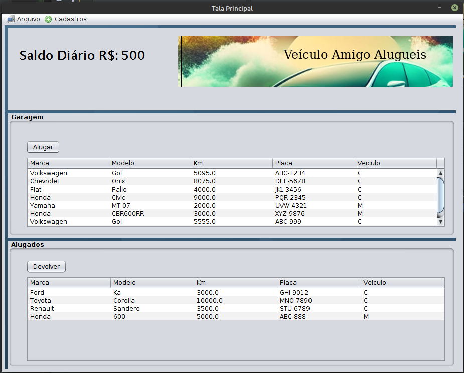
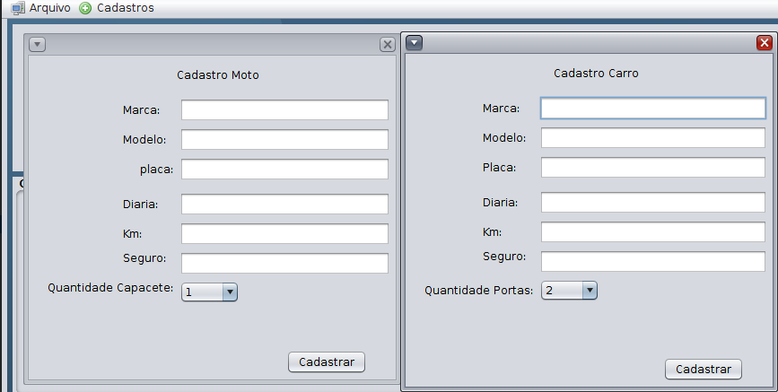
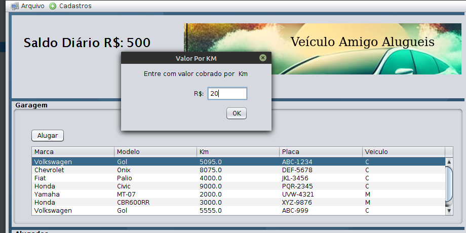
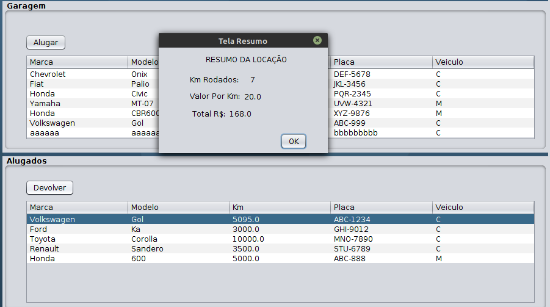
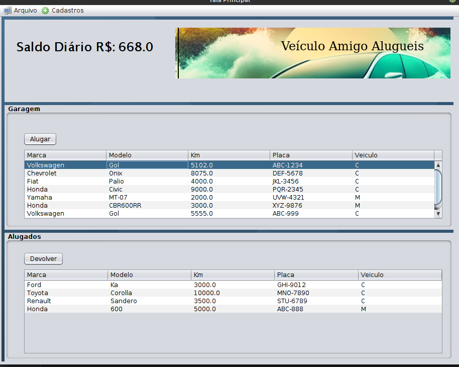

# Trabalho Java C3
```
Disciplina: LINGUAGEM DE PROGRAMAÇÃO ORIENTADA A OBJETOS 
Professor: Cinthia Cristina Lucio Caliari 
Instituição: Faesa Centro Universitario
```

## Veículo amigo Alugueis
## Descrição

O "Veículo do Amigo Aluguéis" é um pequeno projeto desenvolvido durante o período de aprendizado com a professora. Trata-se de um aplicativo para aluguel de veículos e motos. Os usuários poderão alugar um veículo ou moto e serão cobrados com base na quilometragem percorrida.

## Funcionalidades

- Cadastro de carros e motos disponíveis para aluguel
- Monitoramento de veículos na garagem e veículos alugados
- Cálculo da cobrança com base na quilometragem rodada
- Porcentagem de cobrança: 20% para veículos e 10% para motos sobre o valor total da quilometragem cadastrada

## Como usar

1. Faça o download ou clone o repositório para o seu dispositivo.
2. Abra o NetBens vai em Arquivo -> Abrir Projeto... Busque onde salvo o Projeto baixado
3. Dentro do Projeto busque pasta telas abra Tela_Principal e rode o prgrama.

4. Cadastre os Novos veículos disponíveis para aluguel na seção "Cadastra".

5. Na seção "Principal", clique no veículo ou moto e  depois clique no botão alugar e cadastre valor cobrado por Km.

6. Ao devolver o veículo, o aplicativo calculará a quilometragem rodada e efetuará a cobrança automaticamente e mostra um pequeno relatório.

7. Aluguel e Devolução completa

## Contribuições

Contribuições são bem-vindas! Se você deseja melhorar ou adicionar novas funcionalidades ao aplicativo, sinta-se à vontade para fazer um fork do repositório e enviar um pull request.
